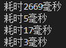

# 缓冲流

## 概述

缓冲流也叫高效流，是对 4 个基本的`FileXXX`流的增强，所以也有 4 个流，按照数据类型分类：

- 字节缓冲流：`BufferedInputStream`，`BufferedOutputStream`
- 字符缓冲流：`BufferedReader`，`BufferedWriter`

缓冲流的基本原理，是在创建流对象时，会创建一个内置的默认大小的缓冲区数组，通过缓冲区读写，减少系统 IO 次数，从而**提高读写的效率**

## 字节缓冲流

### 使用步骤

1. 创建 FileOutputStream 对象
2. 创建 BufferedOutputStream 对象，构造方法中传递 FileOutputStream 对象
3. 使用方法 write，将数据写入到内部缓冲区中
4. 使用方法 flush，将内部缓存区中的数据刷新到硬盘中
5. 释放资源（**关闭缓冲流的时候会自动关闭字节流/字符流**）

### 字节缓冲输出流 BufferedOutputStream

`java.io.BufferedOutputStream extends OutputStream`

#### 构造方法

- `BufferedOutputStream(OutputStream out)`
- `BufferedOutputStream(OutputStream out, int size)`：第二个参数指定了缓冲区的大小

`BufferedOutputStream`会给 `OutputStream`添加一个缓冲区，提高写入效率

#### 实例

```java
public static void main(String[] args) {
    try (FileOutputStream fos = new FileOutputStream("a.txt");
            BufferedOutputStream bos = new BufferedOutputStream(fos)) {
                bos.write("我把数据写入到内部缓冲区中".getBytes());
                bos.flush();
                bos.close();
    } catch (IOException e) {
        e.printStackTrace();
    }
}
```

### 字节缓冲输入流 BufferedInputStream

`java.io.BufferedInputStream extends InputStream`

#### 构造方法

- `BufferedInputStream(InputStream out)`
- `BufferedInputStream(InputStream out, int size)`：第二个参数指定了缓冲区的大小

#### 实例

```java
public static void main(String[] args) {
    try (FileInputStream fis = new FileInputStream("src\\a.txt");
            BufferedInputStream bis = new BufferedInputStream(fis)) {
        int len = 0;
        while ((len = bis.read()) != -1) {
            System.out.print((char)len);
        }
    } catch (IOException e) {
        e.printStackTrace();
    }
}
```

### 字节缓冲流效率测试

1. 采用了一个字节读写的方法，直接用文件字节流读写
2. 采用了字节数组缓冲读取的方法，用文件字节流读写
3. 采用了一个字节读写的方法，用缓冲字节流读写
4. 采用了字节数组缓冲读取的方法，用缓冲字节流读写

最终结果为 

```java
public class IOTest {
    public static void main(String[] args) {
        copyDirectly();
        copyWithArray();
        copyWithBuffer1();
        copyWithBuffer2();
    }

    public static void copyDirectly() { // 一次读写一个字节
        long s = System.currentTimeMillis();
        try (FileInputStream fis = new FileInputStream("D:\\青年大学习\\青年大学习.xlsx");
                FileOutputStream fos = new FileOutputStream("copyDirectly.xlsx")) {
            int len; // 记录了所读取的字节
            while ((len = fis.read()) != -1) {
                fos.write(len);
            }
        } catch (IOException e) {
            System.out.println(e);
        }
        long e = System.currentTimeMillis();
        System.out.println("耗时" + (e - s) + "毫秒");
        // 耗时 1302 毫秒
    }

    public static void copyWithArray() {
        long s = System.currentTimeMillis();
        try (FileInputStream fis = new FileInputStream("D:\\青年大学习\\青年大学习.xlsx");
                FileOutputStream fos = new FileOutputStream("copyWithArray.xlsx")) {
            int len; // 记录了所读取的字节
            byte[] b = new byte[1024];
            while ((len = fis.read(b)) != -1) {
                fos.write(b);
            }
        } catch (IOException e) {
            System.out.println(e);
        }
        long e = System.currentTimeMillis();
        System.out.println("耗时" + (e - s) + "毫秒");
    }

    public static void copyWithBuffer1() {
        long s = System.currentTimeMillis();
        try (BufferedInputStream bis = new BufferedInputStream(new FileInputStream("D:\\青年大学习\\青年大学习.xlsx"));
                BufferedOutputStream bos = new BufferedOutputStream(new FileOutputStream("copyWithBuffer1.xlsx"))) {
            int len = 0;
            while ((len = bis.read()) != -1) {
                bos.write(len);
            }
        } catch (IOException e) {
            System.out.println(e);
        }
        long e = System.currentTimeMillis();
        System.out.println("耗时" + (e - s) + "毫秒");
    }

    public static void copyWithBuffer2() {
        long s = System.currentTimeMillis();
        try (BufferedInputStream bis = new BufferedInputStream(new FileInputStream("D:\\青年大学习\\青年大学习.xlsx"));
                BufferedOutputStream bos = new BufferedOutputStream(new FileOutputStream("copyWithBuffer1.xlsx"))) {
            int len = 0;
            byte[] b = new byte[1024];
            while ((len = bis.read(b)) != -1) {
                bos.write(b);
            }
        } catch (IOException e) {
            System.out.println(e);
        }
        long e = System.currentTimeMillis();
        System.out.println("耗时" + (e - s) + "毫秒");
    }
}

```

## 字符缓冲流

### 字符缓冲输出流 BufferedWriter

#### 构造方法

`BufferedWriter(Writer out)`

`BufferedWriter(Writer out, int sz)`：第二个参数决定了缓冲区的大小

#### 特有的成员方法

**`public void newLine()`**：==换行==；写入一个行分隔符；会根据不同的操作系统，获取不同的行分隔符

#### 实例

```java
public static void main(String[] args) {
    try(BufferedWriter bw = new BufferedWriter(new FileWriter("a.txt"))){
        for(int i=0;i<10;i++){
            bw.write("陈彦琦");
            bw.newLine();
        }
        bw.close();
    } catch(IOException e){
        System.out.println(e);
    }
}
```

### 字符缓冲输入流 BufferedReader

#### 构造方法

`BufferedReader(Reader in)`

`BufferedReader(Reader in, int sz)`：第二个参数决定了缓冲区的大小

#### 特有成员方法

**`public String readLine()`**：读一行文本；返回值为该行内容的字符串，但不包含任何终止符（比如`\r \n`），如果已经到达结尾，则返回 null

#### 实例

``` java
public static void main(String[] args) {
    try (BufferedReader br = new BufferedReader(new FileReader("a.txt"))) {
        String str;
        while ((str = br.readLine()) != null) {
            System.out.println(str);
        }
        br.close();
    } catch (IOException e) {
        System.out.println(e);
    }
}
```

## 练习：文本排序

### 分析

1. 创建一个 HashMap 集合对象，key 可以存储每行文本的序号；value 存储每行的文本
2. 使用字符缓冲输入流中的方法 `readline()`逐行读取文本
3. 对读取到的文本进行切割，获取行中的序号和文本内容
4. 把切割好的序号和文本内容存储到 HashMap 集合中（key 序号是有序的，会自动排序）
5. 遍历 HashMap 集合，获取键值对，并拼接为文本行
6. 通过字符缓冲输出流写入到文件中

### 待处理文件

```
3.侍中、侍郎郭攸之、费祎、董允等，此皆良实，志虑忠纯，是以先帝简拔以遗陛下。愚以为宫中之事，事无大小，悉以咨之，然后施行，必得裨补阙漏，有所广益。
8.愿陛下托臣以讨贼兴复之效，不效，则治臣之罪，以告先帝之灵。若无兴德之言，则责攸之、祎、允等之慢，以彰其咎；陛下亦宜自谋，以咨诹善道，察纳雅言，深追先帝遗诏，臣不胜受恩感激。
4.将军向宠，性行淑均，晓畅军事，试用之于昔日，先帝称之曰能，是以众议举宠为督。愚以为营中之事，悉以咨之，必能使行阵和睦，优劣得所。
2.宫中府中，俱为一体，陟罚臧否，不宜异同。若有作奸犯科及为忠善者，宜付有司论其刑赏，以昭陛下平明之理，不宜偏私，使内外异法也。
1.先帝创业未半而中道崩殂，今天下三分，益州疲弊，此诚危急存亡之秋也。然侍卫之臣不懈于内，忠志之士忘身于外者，盖追先帝之殊遇，欲报之于陛下也。诚宜开张圣听，以光先帝遗德，恢弘志士之气，不宜妄自菲薄，引喻失义，以塞忠谏之路也。
9.今当远离，临表涕零，不知所言。
6.臣本布衣，躬耕于南阳，苟全性命于乱世，不求闻达于诸侯。先帝不以臣卑鄙，猥自枉屈，三顾臣于草庐之中，咨臣以当世之事，由是感激，遂许先帝以驱驰。后值倾覆，受任于败军之际，奉命于危难之间，尔来二十有一年矣。
7.先帝知臣谨慎，故临崩寄臣以大事也。受命以来，夙夜忧叹，恐付托不效，以伤先帝之明，故五月渡泸，深入不毛。今南方已定，兵甲已足，当奖率三军，北定中原，庶竭驽钝，攘除奸凶，兴复汉室，还于旧都。此臣所以报先帝而忠陛下之职分也。至于斟酌损益，进尽忠言，则攸之、祎、允之任也。
5.亲贤臣，远小人，此先汉所以兴隆也；亲小人，远贤臣，此后汉所以倾颓也。先帝在时，每与臣论此事，未尝不叹息痛恨于桓、灵也。侍中、尚书、长史、参军，此悉贞良死节之臣，愿陛下亲之信之，则汉室之隆，可计日而待也。
```

### 代码

```java
public class IOTest {
    public static void main(String[] args) {
        // 创建 HashMap 集合对象
        HashMap<String, String> map = new HashMap<>();

        // 创建字符缓冲输入流
        try (BufferedReader br = new BufferedReader(new FileReader("src\\a.txt"));
                BufferedWriter bw = new BufferedWriter(new FileWriter("src\\b.txt"))) {
            String line;

            // 读取文本内容
            while ((line = br.readLine()) != null) {

                // 切割文本内容
                String[] arr = line.split("\\."); // 用 split 方法，以转义字符 . 为分隔符切割，返回数组

                // 把切割好的文本内容储存到 HashMap 集合中（key序号是有序的，会自动排序）
                map.put(arr[0], arr[1]);
            }

            // 遍历 HashMap 集合，获取每一个键值对
            for (String key : map.keySet()) { // 获取 key集 的数组
                String value = map.get(key); // 通过 key 值获取value

                // 把键值对拼接成一行
                line = key + "." + value;

                // 把拼接好的文本，写入到文件中去
                bw.write(line);
                bw.newLine(); // 换行
            }
        } catch (IOException e) {
            System.out.println(e);
        }

    }
}
```

