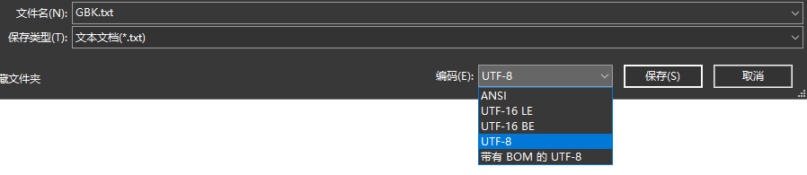

# 转换流

## 字符编码与字符集

### 字符编码

编码：字符（能看懂的）-->字节（看不懂的）

解码：字节（看不懂的）-->字符（看得懂的）

### 字符集

- 字符集`Charset`：也叫 编码表

常见的字符集有：ASCII 字符集、GBK 字符集、Unicode 字符集

## 编码引出的问题

由于 IDEA 和 VS-CODE 的 设置，读取文本文件默认都是`UTF-8`编码，当读取用 Windows 系统创建的默认编码的文本文件时（win 默认编码为 GBK），会出现乱码

### 解决方案

1. 将文本文件另存为 UTF-8 格式的文本	
2. 使用转化流

## InputStreamReader

`InputStreamReader`是**字节流通向字符流的桥梁**：它使用指定的 charset（字符集/编码表） 读取字节并将其解码为字符；它使用的字符集可以由名称指定或者显示指定，或者可以接受平台默认的字符集

`java.io.InputStreamReader extends Reader`

### 构造方法

- `public InputStreamReader(InputStream in)`：使用默认字符编码
- `public InputStreamReader(InputStream in, String charsetName)`：使用指定字符集
### 实例

```java
public static void main(String[] args) {
    try (InputStreamReader isr = new InputStreamReader(new FileInputStream("src\\GBK.txt"), "gbk")) {
        int len = 0;
        while ((len = isr.read()) != -1) {
            System.out.print((char) len);
        }
    } catch (IOException e) {
        System.out.println(e);
    }
}
```


## OutputStreamWriter

`OutputStreamWriter`是**字符流通向字节流的桥梁**

`java.io.OutputstreamWriter extends Writer`：可使用指定的 charset 将要写入流中的字符编码为字节

### 构造方法

- `public OutputStreamWriter(OutputStream out)`：使用默认字符编码
- `public OutputStreamWriter(OutputStream out, String charsetName)`：使用指定字符集

参数 `charsetName` 不区分大小写

### 使用步骤

1. 创建`OutputStreamWriter`对象，构造方法中传递字节输出流和指定的编码表名称
2. 使用方法 write，把字符转换为字节存储到缓冲区中（编码）
3. 使用方法 flush，把字节刷新到文件中

### 实例

```java
public static void write_gbk() {
    try (OutputStreamWriter osw = new OutputStreamWriter(new FileOutputStream("src\\GBK.txt"), "gbk")) {
        osw.write("你好");
    } catch (IOException e) {
        System.out.println(e);
    }
}
```

