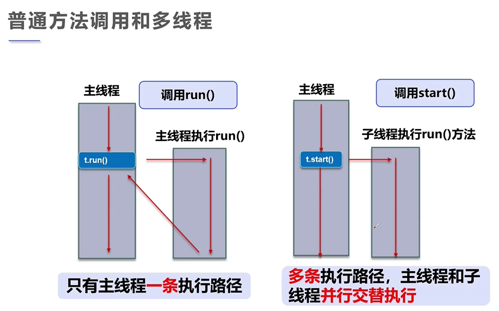

# 概述

## 程序、进程与多线程

- **程序**是指令和数据的有序集合，本身没有运行的含义，是一个静态的观念
- **进程**是执行程序的一次过程，是一个动态的概念；是系统资源分配的单位
- 一个进程可以包含若干**线程**，一个进程中至少包含一个线程；线程是 CPU 调度和执行的单位
- p.s. 真正的多线程指有多个 CPU，即多核，

## 普通方法调用和多线程

	

## 核心概念

- 线程是独立的执行路径
- 在程序运行时，即使没有自己创建线程，后台也会有多个线程，如主线程，gc 线程
- main() 称为主线程，为系统的入口，用于执行整个程序
- 在几个进程中，如果开辟了多个线程，线程的运行有调度器安排调度，调度器与操作系统紧密关联的，先后顺序是不能人为干预
- 对同一份资源进行操作的，会存在资源抢夺的问题，需要加入并发控制
- 线程会带来额外的开销，如 CPU 调度时间，并发控制开销
- 每个线程在自己的工作内存交互，内存控制不当会造成数据不一致

