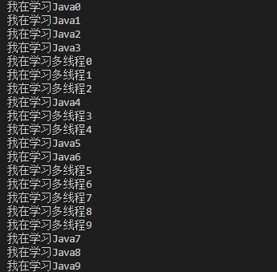
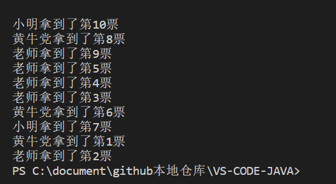

# 创建

## 1.1三种创建方式

1. 继承 **Thread** 类（重点）
2. 实现 **Runnable** 接口（重点）
3. 实现 **Callable** 接口（了解）

## 2.1继承 Thread 类

不建议使用，避免 Java 类的单继承局限性

### 2.2使用步骤

1. 自定义线程类继承 Thread 类
2. 重写 run() 方法，编写线程执行体
3. 创建线程对象，**调用 Start() 方法**启动多线程（如果调用了 run() 方法，会先执行run() 方法）
### 2.3实例

```java
public class ThreadTest {  // 继承 Thread 类
    public static void main(String[] args) {
        StartThread st = new StartThread();  // 创建线程对象
        st.start();  // 开启线程
        for (int i = 0; i < 10; i++) {
            System.out.println("我在学习Java" + i);
        }
    }
}

class StartThread extends Thread {

    @Override
    public void run() {  // 重写 run() 方法
        for (int i = 0; i < 10; i++) {
            System.out.println("我在学习多线程" + i);
        }
    }
}
```

​	结果为           交替运行了

### 2.4总结

线程开启不一定立即执行，由 CPU 调度执行

## 3.1 实现 Runnable 接口

推荐使用这种方法，避免了 Java 的单继承的局限性，方便同一个对象被多个线程使用

### 3.2使用步骤

1. 类实现 Runnable 接口，并实现了 run() 方法
2. 创建类的实例，在创建 Thread 时作为参数传递，并启动

### 3.3 实例

```java
public class ThreadTest implements Runnable {

    @Override
    public void run() {
        for (int i = 0; i < 200; i++) {
            System.out.println("我在学 Java");
        }
    }

    public static void main(String[] args) {
        // 创建 Runnable 接口的实现类对象
        ThreadTest threadTest = new ThreadTest();
        // 创建线程对象，参数为实现了 Runnable 接口的类的实例，通过线程对象来开启线程
        Thread thread = new Thread(threadTest);
        thread.start();
        // 也可以写成 new Thread(threadTest).start();
        for (int i = 0; i < 200; i++) {
            System.out.println("我在学多线程");
        }
    }
}
```

## 4.1 多个线程同时操作一个对象

### 4.2实例

```java
// 多个线程同时操作一个对象
// 买火车票的例子
public class TestThread implements Runnable {

    private int tickNums = 10;

    @Override
    public void run() {
        while (true) {
            if (tickNums <= 0)
                break;
            // Thread.currentThread().getName()：获得当前线程的名字
            System.out.println(Thread.currentThread().getName() + "拿到了第" + tickNums-- + "票");
        }
    }
    public static void main(String[] args) {
        TestThread testThread=new TestThread();
        // 开启三个线程
        new Thread(testThread,"小明").start();  // 第二个参数设置线程的名字
        new Thread(testThread,"老师").start(); 
        new Thread(testThread,"黄牛党").start(); 
    }   
}
```

会出现问题：线程不安全，数据紊乱，如下图所示

	