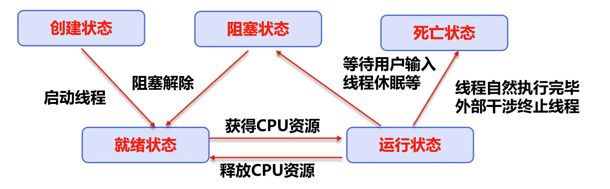
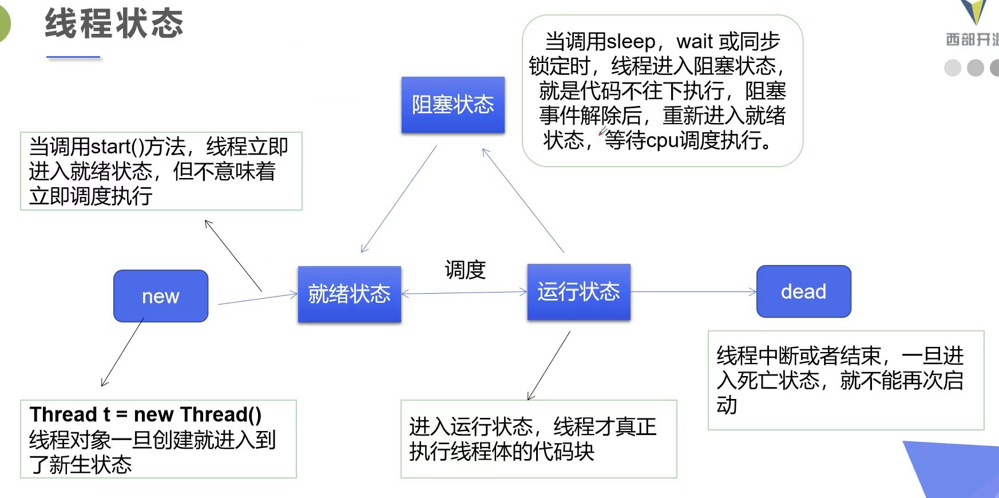

# 线程状体

## 线程的五大状态



详细的说就是



## 线程方法

| 方法                             | 说明                                       |
| :------------------------------- | :----------------------------------------- |
| `setPriority(int newPriority)`   | 更改线程的优先级                           |
| `static void sleep(long millis)` | 在指定的毫秒数内让当前正在执行的线程休眠   |
| `void join()`                    | 等待该线程终止                             |
| `static void yield()`            | 暂停当前正在执行的线程对象，并执行其他线程 |
| `void interrupt()`               | 中断线程，建议别用这个方式                 |
| `boolean isAlive()`              | 测试线程是否处于活动状态                   |

## 停止线程

- 不推荐使用 JDK 提供的`stop()`、`destroy()`方法（已被废弃）
- 建议线程正常停止，不建议死循环
- 建议使用一个标志位进行终止变量，当`flag==false`，则终止线程运行

### 实例

```java
// 线程停止
public class ThreadStop implements Runnable {

    // 1.设置一个标识位
    private boolean flag = true;

    @Override
    public void run() {
        int i = 0;
        while (flag) {
            System.out.println("run....Thread" + i++);
        }
    }

    // 2.设置一个公开的方法停止线程，转换标志位
    public void stop() {
        this.flag = false;
    }

    public static void main(String[] args) {
        ThreadStop threadStop = new ThreadStop();

        new Thread(threadStop).start();

        for (int i = 0; i < 1000; i++) {
            System.out.println("main" + i);
            if (i == 900) {
                // 3.调用 stop 方法切换标志位，让线程停止（这是自己写的 stop 方法，不是 JDK 提供的）
                threadStop.stop();
                System.out.println("线程该停止了");
            }
        }
    }
}

```

## 线程休眠

- `sleep()`指定当前线程休眠的毫秒数
- `sleep()`存在异常`InterruptedException`
- `sleep()`时间达到后进入就绪状态
- `sleep()`可以模拟网络延迟、倒计时等
- 每一个对象都有锁，`sleep()`不会释放锁

### 用法一：模拟延迟

目的：放大问题的发生性

```java
public class ThreadSleep implements Runnable {

    private int ticketNums = 10;

    @Override
    public void run() {
        while (true) {
            if (ticketNums <= 0)
                break;

            // 模拟延时
            try {
                Thread.sleep(200);
            } catch (InterruptedException e) {
                System.out.println(e);
            }

            System.out.println(Thread.currentThread().getName() + "-->拿到了第" + ticketNums-- + "张票");
        }
    }

    public static void main(String[] args) {
        ThreadSleep ticket = new ThreadSleep();

        new Thread(ticket, "小明").start();
        new Thread(ticket, "老师").start();
        new Thread(ticket, "黄牛").start();
    }
}
```

### 用法二：模拟倒计时

```java
public class ThreadSleep {

    public static void main(String[] args) {
        try {
            tenDown();
        } catch (InterruptedException e) {
            System.out.println(e);
        }
    }

    public static void tenDown() throws InterruptedException {
        int num = 10;
        while (true) {
            Thread.sleep(1000);
            System.out.println(num--);
            if (num <= 0) {
                break;
            }
        }
    }
}
```

### 用法三：打印系统当前时间

```java
public class ThreadSleep {

    public static void main(String[] args) {
        // 打印系统当前时间
        Date startTime = new Date(System.currentTimeMillis()); // 获取系统当前时间
        while (true) {
            try {
                Thread.sleep(1000);
                System.out.println(new SimpleDateFormat("HH:mm:ss").format(startTime));
                startTime = new Date(System.currentTimeMillis()); // 更新时间
            } catch (InterruptedException e) {
                e.printStackTrace();
            }
        }
    }

    public static void tenDown() throws InterruptedException {
        int num = 10;
        while (true) {
            Thread.sleep(1000);
            System.out.println(num--);
            if (num <= 0) {
                break;
            }
        }
    }
}
```

## 线程礼让

- 将当前正在执行的线程停止，但不阻塞
- 将线程从运行状态转换为就绪状态
- **让 CPU 重新调度，礼让不一定成功，看 CPU 如何调度**

```java
public class TestYield {
    public static void main(String[] args) {
        MyYield myYield=new MyYield();

        new Thread(myYield,"a").start();
        new Thread(myYield,"b").start();
    }
}

class MyYield implements Runnable {

    @Override
    public void run() {
        System.out.println(Thread.currentThread().getName() + "线程开始执行");
        Thread.yield(); // 线程礼让
        System.out.println(Thread.currentThread().getName() + "线程停止执行");
    }

}
```

## 线程强制执行

- `jion()`合并线程，待此线程执行完成后，再执行其他线程，其他线程会进入阻塞状态
- 可以想象成插队
- 不太建议使用

```java
public class TestJoin implements Runnable {
    public void run() {
        for (int i = 0; i < 500; i++) {
            System.out.println("线程" + i + "在插队");
        }
    }

    public static void main(String[] args) throws InterruptedException {
        TestJoin testJoin = new TestJoin();

        // 启动插队的线程
        Thread thread = new Thread(testJoin);

        // 启动主线程
        for (int i = 0; i < 300; i++) {
            if (i == 200)
                thread.start();
                thread.join(); // 插队
            System.out.println("main" + i);
        }
    }
}
```

## 观测线程状态

