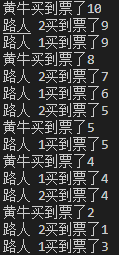

# 线程同步机制

## 概念

- 处理线程问题时，多个线程访问同一个对象，并且某些线程还想修改这个对象，这个时候我们就需要**线程同步**
- 线程同步其实是一种**等待**机制，多个需要同时访问此对象的线程进入这个**对象的等待池**形成队列，等待前面的线程使用完毕，下一个线程再使用
- 并发：同一个对象被多个线程同时操作
## 锁
- 由于同一进程共享一块储存空间，为了保证数据在方法中被访问时的正确性，在访问时加入**锁机制 synchronized**，当一个线程获得对象的排它锁，会独占资源，其他线程必须等待，使用后释放锁即可

### 锁机制带来的问题

1. 一个线程持有锁会导致其他所有需要此锁的线程挂起
2. 在多线程竞争下，加锁、释放锁会导致比较多的上下文切换和调度延时，引起性能问题
3. 如果一个优先级高的线程等待一个优先级低的线程，会导致优先级倒置，引起性能问题

## 线程不安全的案例

### 案例一

```java
package src.com.bencyq.Thread;

public class UnsafeBuyTicket {
    public static void main(String[] args) {
        BuyTicket station = new BuyTicket();

        new Thread(station, "路人 1").start();
        new Thread(station, "路人 2").start();
        new Thread(station, "黄牛").start();
    }
}

class BuyTicket implements Runnable {

    private int ticketNums = 10;
    boolean flag = true;

    @Override
    public void run() {
        // 买票
        while (flag) {
            try {
                buy();
            } catch (InterruptedException e) {
                e.printStackTrace();
            }
        }
    }

    private void buy() throws InterruptedException {
        // 判断是否有票
        if (ticketNums <= 0) {
            flag = false;
            return;
        }

        // 模拟延时
        Thread.sleep(100);

        // 买票
        System.out.println(Thread.currentThread().getName() + "买到票了" + ticketNums--);
    }

}
```

一张票被多个人获取

	

### 案例二

```java
package src.com.bencyq.Thread;

public class UnsafeBank {
    public static void main(String[] args) {
        // 创建账户
        Account account = new Account(100, "基金");
        Drawing you = new Drawing(account, 50, "你");
        Drawing girlFriend = new Drawing(account, 100, "你");
        you.start();
        girlFriend.start();
    }
}

// 账户
class Account {
    int money; // 余额
    String name; // 卡名

    public Account(int money, String name) {
        this.money = money;
        this.name = name;
    }
}

// 银行：模拟取款
class Drawing extends Thread {
    Account account; // 账户

    int drawingMoney; // 取了多少钱

    int nowMoney;// 现在手里有多少钱

    public Drawing(Account account, int drawingMoney, String name) {
        super(name);
        this.account = account;
        this.drawingMoney = drawingMoney;
    }

    // 取钱
    @Override
    public void run() {
        // 判断有没有钱
        if (account.money < drawingMoney) {
            System.out.println(Thread.currentThread().getName() + "钱不够，取不了");
            return;
        }

        // 放大问题的发生性
        try {
            Thread.sleep(1000);
        } catch (InterruptedException e) {
            e.printStackTrace();
        }

        // 卡内余额
        account.money = account.money - drawingMoney;

        // 你手里的钱
        nowMoney = nowMoney + drawingMoney;

        System.out.println(account.name + "余额为 " + account.money);
        System.out.println(this.getName() + "手里的钱 " + nowMoney);
    }
}

```

钱被多拿了

	

### 案例三：List 集合的线程不安全

```java
package src.com.bencyq.Thread;

import java.util.*;

public class UnsafeList {
    public static void main(String[] args) {
        List<String> list = new ArrayList<String>();
        for (int i = 0; i < 10000; i++) {
            new Thread(() -> {
                list.add(Thread.currentThread().getName());
            }).start();
        }
        try {
            Thread.sleep(3000);
        } catch (InterruptedException e) {
            e.printStackTrace();
        }
        System.out.println(list.size());
    }
}
```

输出结果为 9987（原本应该是输出10000）

因为有不同 的线程同时对一个资源进行了操作