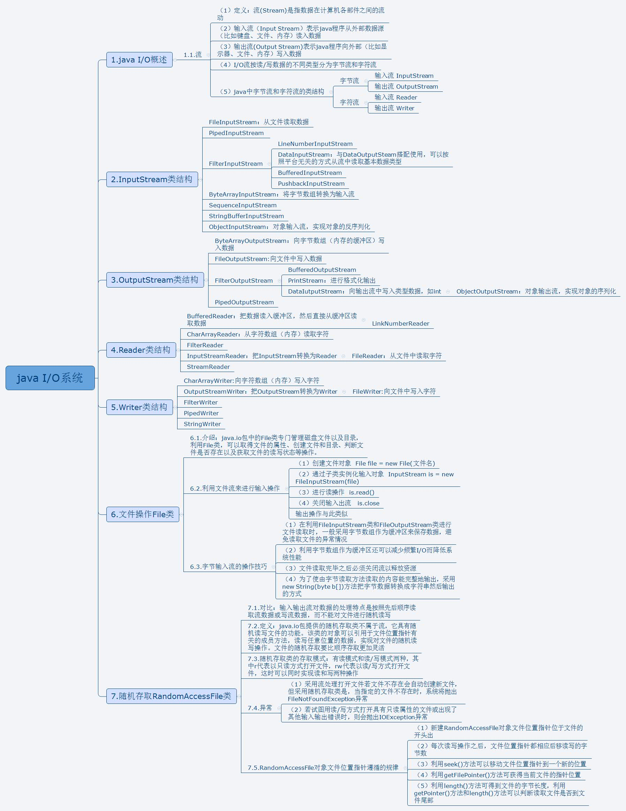

#  Java IO流 概述

## 基本概念

Java 使用 IO流用来读写数据，分为输入流和输出流。

Java 中所有的流都在 Java.io.* 下

Java 的 IO流有四大块：

1. java.io.InputStream        字节输入流
2. java.io.OutputStream     字节输出流
3. java.io.Reader                字符输入流
4. java.io.Writer                  字符输出流

以 Stream 为结尾的都是字节流，以 Reader/Writer 为结尾的都是字符流

所有流都实现了 java.io.Closeabel 接口，都有 close() 方法，都是可关闭的

流是内存和硬盘之间的通道，用完一定要关闭，不然会占用很多资源

## IO流总览	

	

## IO流特性

1、先进先出，最先写入输出流的数据最先被输入流读取到

2、顺序存取，可以一个接一个地往流中写入一串字节，读出时也将按写入顺序读取一串字节，不能随机访问中间的数据（RandomAccessFile**可以从文件的任意位置进行存取（输入输出）操作**）

3、只读或只写，每个流只能是输入流或输出流的一种，不能同时具备两个功能，输入流只能进行读操作，对输出流只能进行写操作。在一个数据传输通道中，如果既要写入数据，又要读取数据，则要分别提供两个流

## IO流常用的五类一接口

在整个Java.io包中最重要的就是5个类和一个接口。5个类指的是File、OutputStream、InputStream、Writer、Reader；一个接口指的是Serializable.掌握了这些IO的核心操作那么对于Java中的IO体系也就有了一个初步的认识了。

主要的类如下：

1. File（文件特征与管理）：File类是对文件系统中文件以及文件夹进行封装的对象，可以通过对象的思想来操作文件和文件夹。 File类保存文件或目录的各种元数据信息，包括文件名、文件长度、最后修改时间、是否可读、获取当前文件的路径名，判断指定文件是否存在、获得当前目录中的文件列表，创建、删除文件和目录等方法。  

2. InputStream（二进制格式操作）：抽象类，基于字节的输入操作，是所有输入流的父类。定义了所有输入流都具有的共同特征。

3. OutputStream（二进制格式操作）：抽象类。基于字节的输出操作。是所有输出流的父类。定义了所有输出流都具有的共同特征。

4. Reader（文件格式操作）：抽象类，基于字符的输入操作。

   5. Writer（文件格式操作）：抽象类，基于字符的输出操作。

   6. RandomAccessFile（随机文件操作）：一个独立的类，直接继承至Object.它的功能丰富，可以从文件的任意位置进行存取（输入输出）操作。

	

## 字节流和字符流

### 由来

因为数据编码的不同，而有了对字符进行高效操作的流对象，本质上其实就是对于字节流的读取时，去查了指定的码表。

### 使用情况

字符流和字节流的使用范围：字节流一般用来处理图像，视频，以及PPT，Word类型的文件。字符流一般用于处理纯文本类型的文件，如TXT文件等，字节流可以用来处理纯文本文件，但是字符流不能用于处理图像视频等非文本类型的文件。

### 区别

节流没有缓冲区，是直接输出的，而字符流是输出到缓冲区的。因此在输出时，字节流不调用colse()方法时，信息已经输出了，而字符流只有在调用close()方法关闭缓冲区时，信息才输出。要想字符流在未关闭时输出信息，则需要手动调用flush()方法。

- 读写单位不同：字节流以字节（8bit）为单位，字符流以字符为单位，根据码表映射字符，一次可能读多个字节。

- 处理对象不同：字节流能处理所有类型的数据（如图片、avi等），而字符流只能处理字符类型的数据。

**结论：只要是处理纯文本数据，就优先考虑使用字符流。除此之外都使用字节流。**

