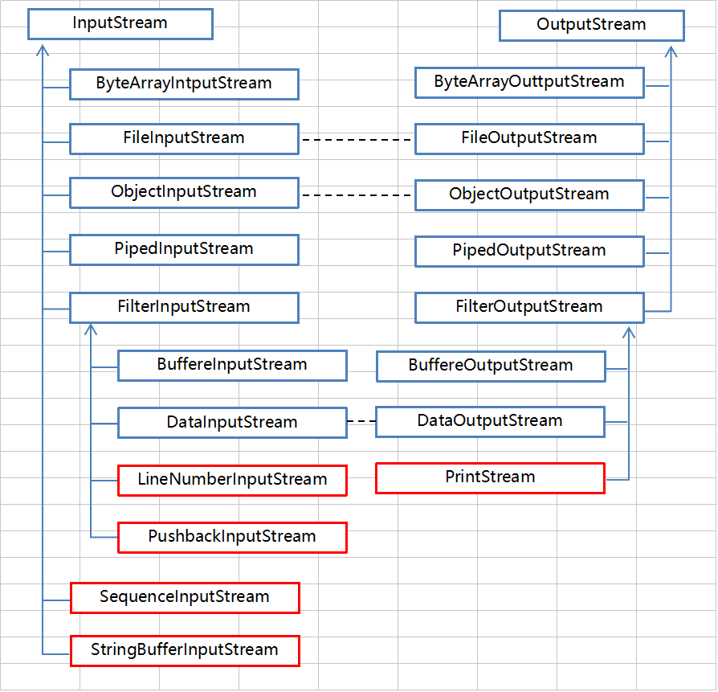

# Java IO流 字节流

## 概览图

	

图中蓝色为主要对应部分，红色为不对应部分，黑色的虚线部分代表这些流一般需要搭配使用。从上面的图中可以看出Java IO中的字节流是非常对称的。我们来看看这些字节流中不对称的几个类。

1. LineNumberInputStream 主要完成从流中读取数据时，会得到相应的行号，至于什么时候分行、在哪里分行是由改类主动确定的，并不是在原始中有这样一个行号。在输出部分没有对应的部分，我们完全可以自己建立一个LineNumberOutputStream，在最初写入时会有一个基准的行号，以后每次遇到换行时会在下一行添加一个行号，看起来也是可以的。好像更不入流了。
2. PushbackInputStream 的功能是查看最后一个字节，不满意就放入缓冲区。主要用在编译器的语法、词法分析部分。输出部分的BufferedOutputStream 几乎实现相近的功能。
3. StringBufferInputStream 已经被Deprecated，本身就不应该出现在InputStream 部分，主要因为String 应该属于字符流的范围。已经被废弃了，当然输出部分也没有必要需要它了！还允许它存在只是为了保持版本的向下兼容而已。
4. SequenceInputStream 可以认为是一个工具类，将两个或者多个输入流当成一个输入流依次读取。完全可以从IO 包中去除，还完全不影响IO 包的结构，却让其更“纯洁”――纯洁的Decorator 模式。
5. PrintStream 也可以认为是一个辅助工具。主要可以向其他输出流，或者FileInputStream 写入数据，本身内部实现还是带缓冲的。本质上是对其它流的综合运用的一个工具而已。一样可以踢出IO 包！System.out 和System.out 就是PrintStream 的实例。

## 字节输入流 InputStream

从IO中输入字节流的继承图中可以看出。

1. InputStream是所有数据字节流的父类，它是一个抽象类。

2. ByteArrayInputStream、StringBufferInputStream、FileInputStream是三种基本的介质流，它们分别从Byte数组、StringBuffer、和本地文件中读取数据，PipedInputStream是从与其他线程共用的管道中读取数据。

3. ObjectInputStream 和所有 FileInputStream 的子类都是装饰流（装饰器模式的主角）。

## 字节输出流 OutputStream

从IO中输入字节流的继承图中可以看出。

1. OutputStream是所有输出字节流的父类，它是一个抽象类，定义了一些共性的方法
2. ByteArrayOutputStream、FIleOutputStream 是两种基本的介质，它们分别向Byte 数组，和本地文件中写入数据。PipedOutputStream 是从与其他线程共用的管道中写入数据。
3. ObjectOutputStream 和所有 FileOutputStream 的子类都是装饰流。 
### 共有方法

`public void close()`：关闭此输出流，并释放与此流相关的任何系统资源

`public void flush()`：刷新此输出流，并强制任何缓冲输出字节被写出

`public void write(byte[] b)`：在硬盘中写入该字节数组

`public void write(byte[] b, int off, int len)`：写入字节数组的一部分

`public abstract void write(int b)`：将指定的字节输出流

### 文件字节输出流 FileOutputStream

#### 作用

把内存中的数据写入到硬盘的文件中，如果无该文件则创建该文件

#### 构造方法

`FileOutputStream(String name)`: 创建一个向具有指定名称的文件中写入数据的文件字节输出流

`FileOutputStream(File file)`: 创建一个向指定 File 对象表示的文件中写入数据的文件字节输出流

#### 写出字节数据

##### 方法

`public void write(byte[] b)`：在硬盘中写入该字节数组

- 如果写的第一个字节是正数，那么显示的时候会查询 ASCII 表

- 如果写的第一个字节是负数，那么第一个和第二个字节会组成一个中文显示，查询系统默认码表（GBK）

==**`public byte[] getBytes()`**==：可以用 java.lang 包中的该方法 ，获取字符串的字节表达形式

##### 实例

```java
public static void main(String[] args)throws IOException{  // FileOutputStream 会抛出异常
    FileOutputStream fos = new FileOutputStream("c:\\document\\a.txt");
    fos.write("你好".getBytes()); 
    fos.write(1);
    fos.close();
}  
```

#### 数据的追加续写

